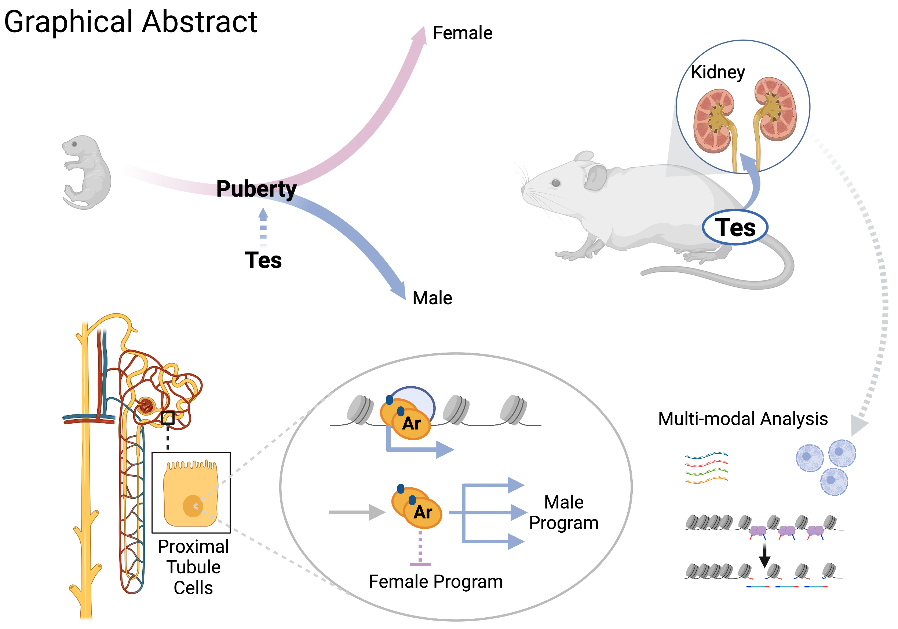
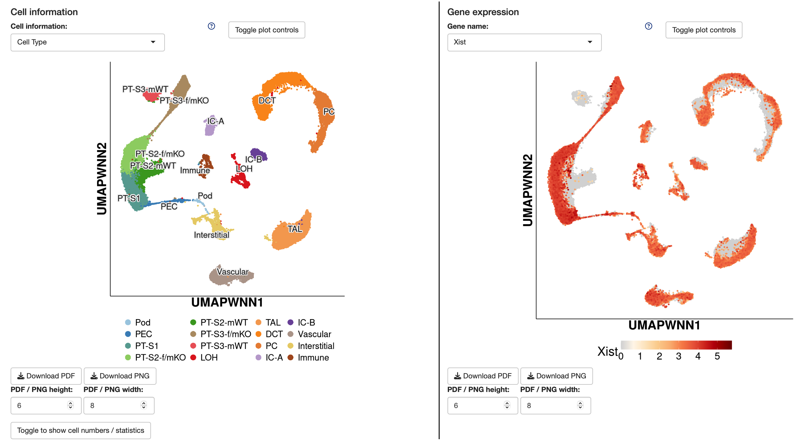

# Kidney_SexDiff

This repository contains processed data files and customized R scripts generated during the following study:

"Direct androgen receptor control of sexually dimorphic gene expression in the mammalian kidney" by \
**Lingyun Xiong**§, Jing Liu§, Sueng Yub Han, Kari Koppitch, Jin-Jin Guo, Megan Rommelfanger, Fan Gao, \
Ingileif Hallgrimsdottir, Lior Pachter, Junhyong Kim, Adam L. MacLean, Andrew P. McMahon (§ Co–first Authors).

This study is now publsihed (PMID: 37673062): [https://doi.org/10.1016/j.devcel.2023.08.010](https://doi.org/10.1016/j.devcel.2023.08.010) and referred to in a nephrology digest article: [https://doi.org/10.1016/j.kint.2023.11.017](https://doi.org/10.1016/j.kint.2023.11.017).

A companion review is also available: [https://www.nature.com/articles/s41581-023-00757-2](https://www.nature.com/articles/s41581-023-00757-2)

An interactive browser for the single-nuclei RNA-seq & ATAC-seq dataset generated in this study is now available: [https://nelsonlab.shinyapps.io/Mouse_Male_Female_Kidney/](https://nelsonlab.shinyapps.io/Mouse_Male_Female_Kidney/) 

